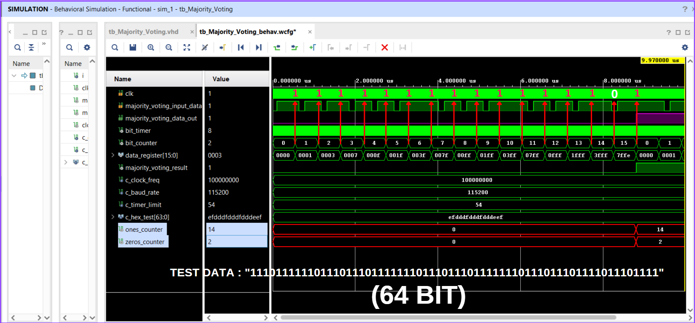

# Majority-Voting-Technique
Design a Majority Voting Technique module using VHDL in Vivado and verify it with a Test Bench

# Design a Majority Voting Technique module using VHDL in Vivado and verify it with a Test Bench

In modern communication protocols, certain techniques are used to prevent bit errors caused by external electromagnetic fields affecting digital systems. These techniques act as a filter by sampling incoming data bit by bit to correct errors that may occur.

In this repository, I will design a module that processes an 8-bit communication data stream by taking 16 samples per bit and determining the final bit value based on the majority count of 1s and 0s. The design is implemented in VHDL using Vivado and has been verified through simulation.

Choosing Clock and Data Transmission Speed
Before starting the design, let's define the clock frequency and data transmission rate:

CLOCK_FREQ => 100MHz
BAUDRATE => 115200 Bps
Each bit transmission time = 1 / 115200 = 8.68 µs
Sampling interval = 8.68 / 16 = 1 / (115200 * 16) = 0.54 µs

Based on these values, you can find the VHDL code in the VHDL_Files directory.

HERE ARE THE SIMULATION RESULTS OF THE DESIGN! 🚀

1- 64 BIT TEST DATA

2- 16 BIT TEST DATA

